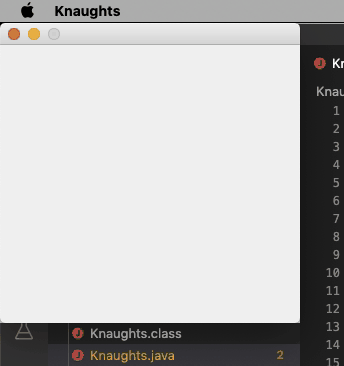

# Knaughts
 rogue-esque schmup
 
 Shoot em up inspired by traditional rogue-likes like NetHack. I need to figure out a way to make the grpahics 
 smoother. I'm building a string iteratively, and drawing it to an image, then displaying it. There's a lot going 
 on to make the string and its quite laggy. Happy to have something going though. 
 
 ~~Trying to be as organized as possible with the code. Should probably split it up into different files.~~ Yeah,
 scratch that. Just hacking.
 
 Demos:
 Using land mines
 
 
 Using the rifle
 
 
 Using the rifle successfully
 
 
